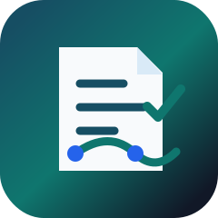
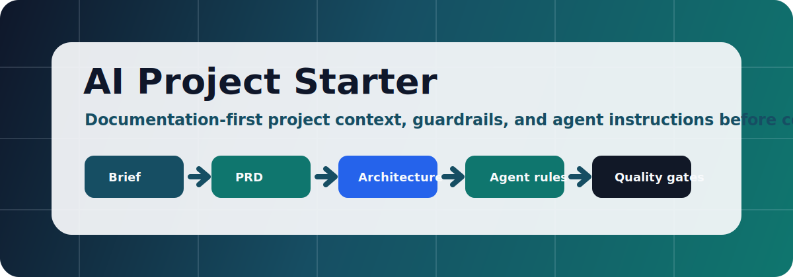

# AI Project Starter

> A Codex skill package for preparing AI-coding-ready project context, starter documentation, domain guardrails, and agent instruction files before implementation starts.

<p align="center">
  
  <br />
  
</p>

<p align="center">
  &#127760; <strong>Languages:</strong>
  <a href="README.de.md"></a> |
  <a href="README.es.md"></a> |
  <a href="README.md"></a> |
  <a href="README.pt-BR.md"></a> |
  <a href="README.tr.md"></a> |
  <a href="README.fr.md"></a>
</p>

<!-- bilingual-welcome:start -->
<table>
  <tr>
    <td width="50%" valign="top">
      <h3> English welcome</h3>
      <p>AI Project Starter prepares project context, PRDs, architecture notes, guardrails, and agent instruction files before an AI coding agent starts implementation.</p>
      <p><strong>Start here:</strong> [Usage guide](docs/USAGE.md) shows the supported modes.</p>
    </td>
    <td width="50%" valign="top">
      <h3> T&#252;rk&#231;e kar&#351;&#305;lama</h3>
      <p>AI Project Starter, AI kodlama ajani uygulamaya baslamadan once proje contexti, PRD, mimari notlar, guardrailler ve ajan talimat dosyalari hazirlar.</p>
      <p><strong>Buradan ba&#351;la:</strong> [README.tr.md](README.tr.md) Turkce proje baslatma akisini toplar.</p>
    </td>
  </tr>
</table>
<!-- bilingual-welcome:end -->

[](LICENSE)
[](SECURITY.md)
[](docs/USAGE.md)
[](README.md)
[](docs/PUBLIC_REPO_CHECKLIST.md)
[](https://github.com/ucsahinn/ai-project-starter/actions/workflows/validate.yml)

- **Status:** initial public-ready skill package
- **License:** MIT
- **Project type:** Markdown-based Codex skill package for context engineering and project starter documentation
- **Note:** Independent community project. Not affiliated with, endorsed by, or sponsored by OpenAI.

AI Project Starter helps turn a raw project idea into a complete documentation foundation before an AI coding agent starts writing code. It is built for Codex, Cursor, Claude Code, Windsurf/Devin, Continue, Copilot, Aider, and similar tools.

##  Enterprise Evaluator Path

| If you need to prove... | Start with | Evidence you get |
| --- | --- | --- |
| The starter will not overwrite existing work by default | [Install guide](docs/INSTALL.md) and [Usage guide](docs/USAGE.md) | Modes, copy path, and safe materialization expectations. |
| The generated context has security and quality gates | [Security model](docs/SECURITY_MODEL.md) | Secret handling, approval boundaries, testing expectations, and public-safe rules. |
| The skill can support a real enterprise starter | [Examples](docs/EXAMPLES.md) | SaaS, cybersecurity, API, web, mobile, desktop, data, internal-tool, and library/CLI patterns. |
| The public repository is safe to share | [Public repo checklist](docs/PUBLIC_REPO_CHECKLIST.md) | Leak-prevention checklist before commit, tag, release, or reuse. |

##  Trust Signals

| Signal | Standard |
| --- | --- |
| Context before code | The skill prepares product, architecture, security, testing, operations, and task context before implementation starts. |
| Mode-gated output | `PROMPT_ONLY`, `DOCS_ONLY`, `PLAN_ONLY`, `CREATE_FILES`, `AUDIT_CONTEXT`, and `REPAIR_CONTEXT` keep the workflow explicit. |
| Public-safe package | Examples and templates use placeholders and avoid credentials, private prompts, customer data, and local operator paths. |
| Agent interoperability | Output targets Codex, Claude Code, Cursor, Continue, Copilot, Devin/Windsurf, Aider, and similar tools without locking the project to one editor. |

##  Why This Exists

AI coding agents fail when the project has no durable context. Vague "build this" prompts often create duplicate modules, weak security, unclear architecture, and features outside the real goal.

This repository packages a reusable Codex skill that creates or repairs:

- project briefs and PRDs,
- technical specs and architecture docs,
- implementation plans and task lists,
- security, testing, and quality gates,
- domain starter packs for SaaS, cybersecurity, AI products, APIs, web, mobile, desktop, data products, internal tools, and library/CLI work,
- agent instruction files such as `AGENTS.md`, `CLAUDE.md`, Cursor rules, Continue rules, Copilot instructions, and Codex context files.

##  Start Fast

| I want to... | Use this |
| --- | --- |
| Start a new AI-coded project safely | [Skill entrypoint](.agents/skills/ai-project-starter/SKILL.md) |
| Understand modes and examples | [Usage guide](docs/USAGE.md) |
| Install/copy the skill | [Install guide](docs/INSTALL.md) |
| Review file structure | [Skill structure](docs/SKILL_STRUCTURE.md) |
| Check public repo safety | [Public repo checklist](docs/PUBLIC_REPO_CHECKLIST.md) |
| Prepare GitHub metadata | [GitHub settings](docs/GITHUB_SETTINGS.md) |
| Improve discoverability | [SEO and discoverability](docs/SEO.md) |
| Review security model | [Security model](docs/SECURITY_MODEL.md) |

##  What You Get

| Capability | What it gives you |
| --- | --- |
| Project context foundation | `README.md`, `PROJECT_BRIEF.md`, `PRODUCT_REQUIREMENTS.md`, `TECHNICAL_SPEC.md`, `ARCHITECTURE.md`, `IMPLEMENTATION_PLAN.md`, `TASKS.md` |
| Agent-ready instructions | `AGENTS.md`, `CLAUDE.md`, Cursor, Continue, Copilot, Devin/Windsurf, Aider, and Codex context files |
| Enterprise starter | security, testing, observability, deployment, operations, risk register, ADRs |
| Domain packs | SaaS, cybersecurity, AI product, API, web, mobile, desktop, data, internal tool, library/CLI docs |
| Vibe-coding guardrails | anti-slop, non-goals, milestone control, no duplicate systems, verification-before-done |
| Context audit/repair | detect weak, stale, duplicate, conflicting, or missing project context docs |
| Template materializer | `scripts/create_starter.py` creates safe starter docs without overwriting by default |

##  Quick Start

Use the skill from this repository:

```text
Use the ai-project-starter skill to prepare project starter docs for: [your project idea]
```

Create files for an enterprise SaaS cybersecurity product:

```text
Use the ai-project-starter skill in CREATE_FILES + ENTERPRISE_STARTER mode.
Project idea: A SaaS cybersecurity platform for vulnerability triage, tenant-based teams, RBAC, audit logs, AI-assisted remediation planning, and secure reporting.
```

Ask for guardrails only:

```text
Use VIBE_GUARDRAILS mode. Prepare only the agent context and quality gates needed to keep this project from drifting during vibe coding.
```

##  Supported Modes

- `PROMPT_ONLY`
- `DOCS_ONLY`
- `PLAN_ONLY`
- `CREATE_FILES`
- `AUDIT_CONTEXT`
- `REPAIR_CONTEXT`
- `ENTERPRISE_STARTER`
- `VIBE_GUARDRAILS`
- `RESEARCH_BACKED`

##  Repository Structure

```text
.
|-- .agents/skills/ai-project-starter/
|   |-- SKILL.md
|   |-- agents/openai.yaml
|   |-- references/
|   |-- scripts/create_starter.py
|   `-- templates/
|-- docs/
|   |-- INSTALL.md
|   |-- USAGE.md
|   |-- EXAMPLES.md
|   |-- SKILL_STRUCTURE.md
|   |-- PUBLIC_REPO_CHECKLIST.md
|   |-- SEO.md
|   |-- GITHUB_SETTINGS.md
|   |-- SECURITY_MODEL.md
|   `-- ROADMAP.md
|-- README.md
|-- README.tr.md
|-- SECURITY.md
|-- CONTRIBUTING.md
|-- CHANGELOG.md
`-- RELEASE_NOTES.md
```

##  Public Safety Rules

This repository must not contain:

- API keys, tokens, credentials, cookies, private keys, certificates, or private URLs,
- customer data or internal company data,
- private system prompts,
- proprietary project implementation details,
- unredacted logs, screenshots, local paths, or personal notes.

Before publishing, use [docs/PUBLIC_REPO_CHECKLIST.md](docs/PUBLIC_REPO_CHECKLIST.md).

##  Security

Do not open public issues for vulnerabilities, leaked credentials, private prompts, or accidental disclosure. See [SECURITY.md](SECURITY.md).

##  License

MIT. See [LICENSE](LICENSE).
